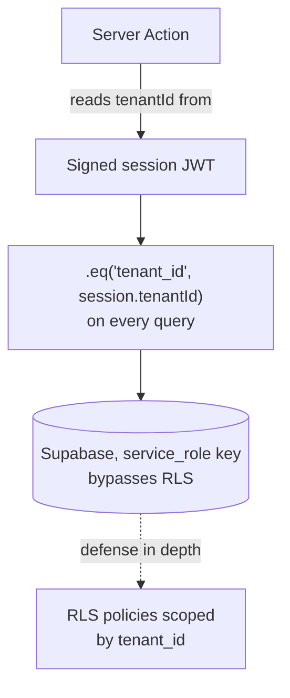
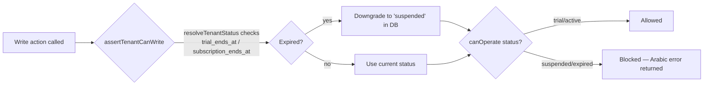
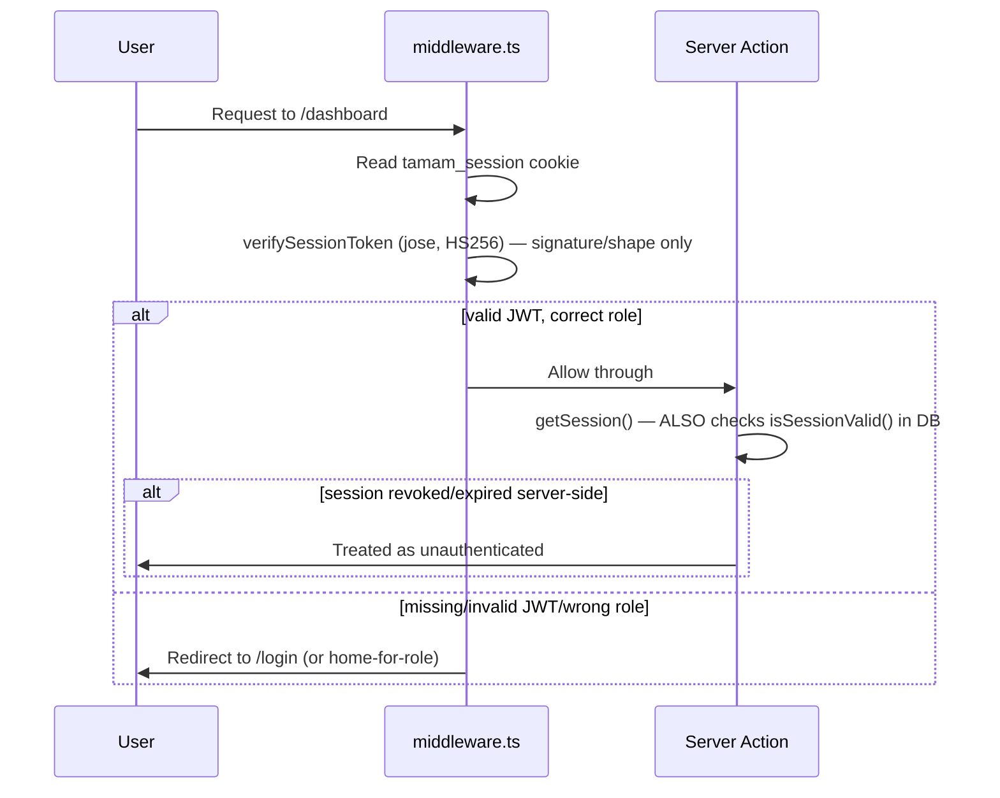

# Architecture

## Tenant isolation model

Every tenant-owned table (`students`, `staff`, `branches`, `rewards`, `points_log`, `redemptions`, `subscriptions`) has a `tenant_id` column. Isolation is enforced in two layers:

1. **Application code (primary layer).** `lib/supabase/server.ts`'s `getSupabaseAdmin()` uses the Supabase `service_role` key, which bypasses Row Level Security entirely. This is deliberate — the service_role client is only ever constructed and used inside server-only code (`"server-only"` import guards this), and every single query in every server action explicitly filters `.eq("tenant_id", session.tenantId)`, where `session.tenantId` comes from the verified session JWT (`lib/auth/get-session.ts`), never from a client-supplied value. A student or staff member can never pass a different tenant's id and read its data, because the tenant id used in every query is the one embedded in their own signed session token.
2. **RLS (defense in depth).** The Mazaya multi-tenant migration (`supabase/migrations/004_mazaya_tenant_upgrade.sql`) also adds RLS policies scoped by `tenant_id`. These matter if anything ever queries Supabase with the `anon`/`authenticated` key instead of `service_role` — today nothing in this app does that (there's no Supabase Auth, no client-side Supabase queries), but the policies exist as a second layer rather than relying solely on every server action remembering to filter correctly. As of `008_security_hardening_upgrade.sql`, `anon`/`authenticated` also have **no table/view grants at all** — RLS is no longer the *only* thing standing between those keys and the data (see the incident note below).

> **A real incident, worth remembering**: `tenant_stats` (a view joining `tenants` with usage/revenue aggregates) had `GRANT SELECT ... TO anon` from `004`/`005`. Postgres views execute with the *view owner's* privileges, not the querying role's — so RLS on the underlying tables did **not** apply when querying through the view. Anyone holding the public `NEXT_PUBLIC_SUPABASE_ANON_KEY` could read every tenant's academy name, owner email/phone, and revenue, cross-tenant, with zero authentication. Confirmed live before the fix. `008_security_hardening_upgrade.sql` revokes it. **Lesson**: a `GRANT ... TO anon` on a *view* needs the same scrutiny as one on a table — RLS on the underlying tables is not a given.

### Why not a shared query layer with automatic tenant scoping?

It would remove the "did every query remember `.eq(tenant_id, ...)`" risk entirely. This codebase doesn't have one today — queries are written directly inside each route's colocated `actions.ts`. If you introduce `lib/supabase/queries/`, the highest-value version of it is a thin wrapper that *forces* a `tenantId` argument into every query builder, rather than just relocating the same manually-scoped queries into a different folder.

## Read-only mode (suspended/expired tenants)

`tenants.status` is one of `trial | active | suspended | expired`.

- **Client-side**: `useReadOnly()` (`hooks/useReadOnly.ts`) reads a shared TanStack Query cache entry (`["tenant-status"]`), seeded once by `AdminShell`/`PortalClient` so every component in the tree sees the same value without a fetch waterfall or a flash of the wrong UI state. Components use `canEdit` to hide/disable write buttons.
- **Server-side**: every write-side server action calls `assertTenantCanWrite(tenantId)` (`lib/tenant/resolve-status.ts`) first. This is the actual enforcement — the client-side hiding is only UX, since a suspended tenant's staff could otherwise still call a server action directly.
- **Auto-expiry**: `resolveTenantStatus()` checks `trial_ends_at`/`subscription_ends_at` against `now()` and downgrades to `suspended` in the DB if expired — checked lazily, at read/write time, not via a cron job or middleware check on every request. This tradeoff (a DB round trip only when a tenant's status is actually being read/written, vs. a background job) was chosen to keep page-load latency unaffected by billing logic.

## Auth flows

There are **two entirely independent auth systems** — this is intentional, not an oversight:

| | Tenant panel/portal | Super Admin panel |
|---|---|---|
| Cookie | `tamam_session` | `mazaya_sa_session` |
| Session module | `lib/auth/session.ts` | `lib/auth/super-admin-session.ts` |
| Session lifetime | 8 hours (staff and student alike) | 4 hours — shorter, since this role can access every tenant |
| Roles | `admin`, `staff`, `student` | (none — one flat role) |
| Login | username+password (staff), phone-only (students) | username+password |

`middleware.ts` branches on whether the path starts with `/super-admin` and applies the corresponding session check — the two are never cross-validated against each other.

### Session revocation

Every session JWT (tenant staff/student and Super Admin alike) carries a `sessionId` claim tied to a row in the `sessions` table (`supabase/migrations/009_sessions_upgrade.sql`). This exists because a bare JWT can't be un-issued — without a server-side record, a leaked token (or an account whose password was just changed, or a staff member who was just deactivated) would remain valid until its natural expiry no matter what.

Two different checks exist deliberately, at two different layers, and it's important not to conflate them:

- **`verifySessionToken()`** (`lib/auth/session.ts`) / **`verifySuperAdminSessionToken()`** — signature and shape only, no DB access. This is what `middleware.ts` uses, because middleware runs on the Edge runtime for every matched request and must stay fast; it's a coarse routing check, not the authorization boundary.
- **`getSession()`** (`lib/auth/get-session.ts`) / **`getSuperAdminSession()`** — the check above, *plus* `isSessionValid(sessionId)` against the `sessions` table (`lib/auth/session-store.ts`). This is what every Server Component and Server Action actually uses to gate data access, and is the real authorization boundary.

Practical consequence: a revoked session can still pass `middleware.ts`'s routing check for up to its JWT's natural expiry (it won't force a redirect), but every actual data-touching call goes through `getSession()`, which correctly treats it as logged out immediately. Sessions are revoked on: explicit logout (`logout()`/`superAdminLogout()`), a staff member's password being reset by a super admin, a staff account being deactivated, and (via `ON DELETE CASCADE` on `sessions.tenant_id`) a tenant being deleted entirely.

`lib/auth/start-session.ts`'s `startSession()`/`startSuperAdminSession()` are the only places that should ever issue a session — they generate the `sessionId`, sign the JWT, write the `sessions` row, and set the cookie together, so none of the three can drift out of sync.

## Rate limiting

`lib/auth/rate-limit.ts`'s `checkLoginRateLimit()` guards every login/registration entry point (staff, student, Super Admin, public self-registration). It prefers Upstash Redis (`UPSTASH_REDIS_REST_URL`/`UPSTASH_REDIS_REST_TOKEN`) when configured — durable across deploys and server instances, which is what actually stops a distributed (many-IP) attacker. If those env vars are unset (e.g. local dev) or Upstash itself errors, it falls back to the original in-memory limiter, which only protects a single running instance and resets on every deploy.

## Audit log

`lib/audit.ts`'s `recordAuditLog()` writes to the `audit_log` table (`supabase/migrations/008_security_hardening_upgrade.sql`) for: login attempts (success and failure, all three login systems), staff creation/deletion, student deactivation, reward/branch deletion, bulk points-import batches, tenant creation/suspension/reactivation, subscription/trial/branch-limit changes, and Super Admin password resets. It's best-effort — a logging failure is itself logged and swallowed rather than failing the action being audited, since the underlying action has generally already succeeded (or, for a failed login, there's nothing to roll back).

### Student login: phone number only, no password

Students authenticate with just their phone number (`app/login/actions.ts`'s `loginStudent`, and `app/register/[token]/actions.ts`'s auto-login after self-registration). This is an explicit, confirmed product decision for a low-stakes loyalty program: anyone who knows a student's phone number can access that student's points/rewards/redeem-reward account. The tradeoff was chosen deliberately over adding a PIN or password, in exchange for a frictionless signup/login flow. The `students.password` column still exists (`NOT NULL`) purely to satisfy the schema — every student row gets an unguessable random hash via `generatePlaceholderPasswordHash()` that is never checked against anything.

### Public, unauthenticated pages

`app/register/[token]/*` (student self-registration) and `app/leaderboard/{branch,overall}/[token]/*` (public leaderboard links) are deliberately **not** included in `middleware.ts`'s `matcher` config — they're public by omission, not by an explicit bypass rule. Each resolves its tenant/branch scope from an unguessable random token column (`branches.registration_token`, `branches.leaderboard_token`, `tenants.leaderboard_token`), looked up server-side — never from a client-supplied id, since these routes have no session to trust.

## Password hashing

All bcrypt calls go through `lib/auth/password.ts`'s `hashPassword`/`comparePassword`, which wrap `bcryptjs` with try/catch (a malformed stored hash makes `comparePassword` return `false` rather than throwing an unhandled error) and centralize the cost factor (`BCRYPT_COST` in `lib/constants.ts`).
